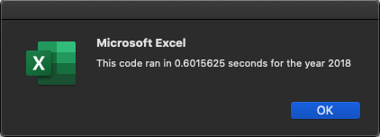
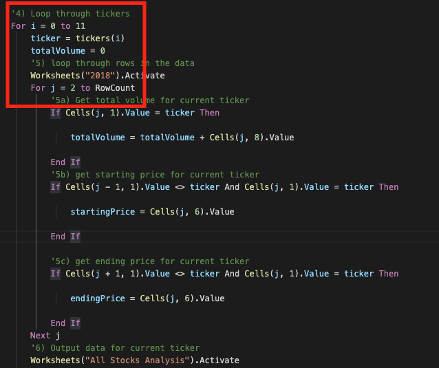
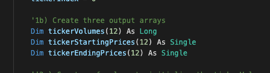

# stock-analysis

### Project Overview
The purpose of this project is to get a better understanding of the provided stock market data. Being able analyse this data will help Steve make a data-driven decision when he helps his parents find a profitable stock. At the moment Steve has no efficent way to process this stock market data. Steve could do this by hand but it would take a large amount of time to process every single row. Steve is fortunate that Microsoft Excel has the programing language Visual Basic for Applications (VBA) which makes repetitive calculation in an extremely short amount of time. In this project VBA plays a big role in processing about 3000 rows in about .59 seconds. Steve can now focus on analysing the results and make comparisons within each stock.

### Results

The provided stock data comes from Steve who wants to help his parents better understand the stocks they own and possibly looking for a higher yielding stock. Steve is interested in finding the daily volume and yearly return for each stock. Daily volume is the total number of shares traded throughout the day; it measures how actively a stock is traded. The yearly return is the percentage differene in price from the the beginning of the year to the end of the year. Steve has right data but not an efficent way to process the data. This is where VBA reduces the overall time spent making those calculations so the analyst can spend their time looking at the results rather than doing repetitive manual computation. Below are the processing times for year 2017 and year 2018. As you can see VBA is much faster than any person and possibly a group people. There is about 3000 rows for both years that contain stock data to process. The stock data contains Ticker, Date, Volumen, etc...

#### Processing Time

#### Stock Results
From the results below 2017 was a positive year for all stocks except TERP which had a -7.2% return for the year. ENPH, SEDG, and DQ are the three stocks with the highest return for year 2017. Lets say Steves parents invested in DQ which in 2017 had the highest return over all, DQ had a 199.4% yearly return. 

2018 was a negative year for all stocks except ENPH and RUN. ENPH had a 81.9% return and RUN had a 84% return for the year 2018. DQ had a -62.6 percent year return which is the highest negative year return compared to the other stocks in this data set. Hopefully Steve can persuade his parents to find a stock that does not have the highest year return but has a positive year return for both years. Based on the data ENPH would be the best stock to go for because both 2017 and 2018 have positive high returns. ENPH does not have the overall highest return compared to other stocks, however, it has a constant positive return for every year. 

### Summary

The two main advantages to refactoring code are having dynamic code and efficency. Prior to refactoring code the for loops inside the macro were not as dynamic which then forces values to be reinitialized after every loop interation. As you can see in the images below the original for loop had to reinitilise the value totalVolume while in the refactored for loop the values for totalVolume were stored in an array. By appending values to an array there would be no need to reinitilise values and the array contains totalVolumes that can be indexed by ticker.

For this macro refactoring code reduced processing time. This can be seen when comparing the processing time process time prior and after refactoring. Below the average processing time for the macro prior to refactoring was about 0.76 seconds. After refactoring the code became much faster because the average processing time was about 0.59 seconds. 

That being said two disadtagages by refactoring the code are limiting array lengths and code complexity. For this particular example there were only 12 different tickers that could be used. What would happen if two more tickers would be added to the list of tickers. If someone would try to execute the macro, the macro would fail because the arrays are set to only hold 12 values. Below is a snippet of the initialised arrays that can only hold 12 values.

Furthermore, by refactoring code the macro increases in complexity. Which means that its difficult to follow along the code unless there is detailed documentation explaing each line. Without detialed documentaion it would almost be impossiple to understand what the person who wrote the code was trying to achueve. 

There is a detailed statement on the advantages and disadvantages of the original and refactored VBA script (3 pt).
